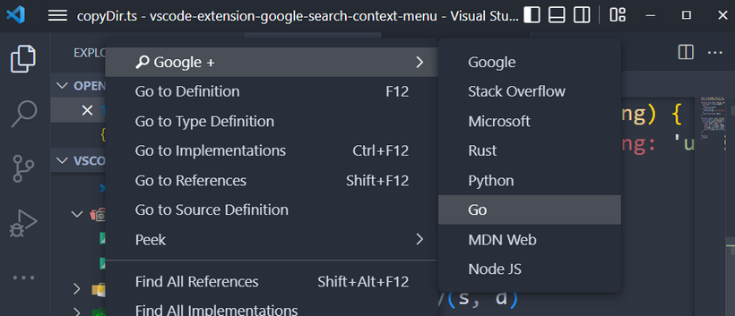
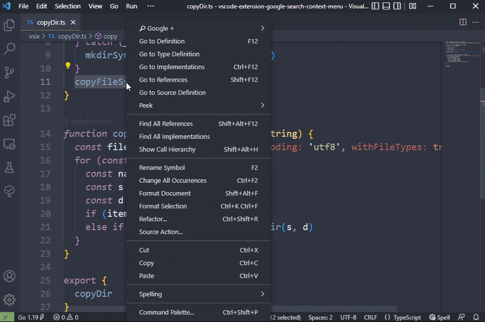
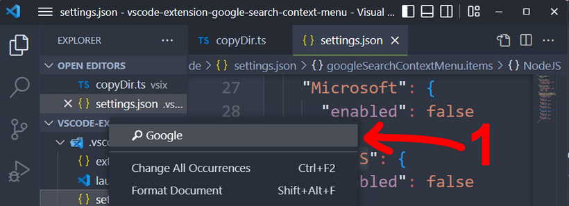

# 🔎︎ Google Search +

📌 Держите под рукой ваши сайты и мгновенно переключайтесь на браузер - Контекстное меню с поиском по нескольким сайтам для VSCode.

[Расширение доступно здесь Marketplace.VisualStudio.com](https://marketplace.visualstudio.com/items?itemName=lonberg.google-search-context-menu)

## Как это выглядит

Расширение использует подменю не загромождая доступ к основным командам _VSCode_. Выберите текст в редакторе и посетите ваш любимый сайт:



Используйте расширенный _Google-поиск_ по сайту или измените шаблон запроса:



Настройте необходимый набор сайтов текущей рабочей области:


Отключение всех пунктов не удалит _Google_, а переместит его в основное меню. Контекстное подменю деактивируется и убирается знак `+`:



По умолчанию активны все подпункты меню.

## Настройки

_Google_ не отключается и намертво прибит к расширению. По умолчанию все шаблоны используют _Google_ с дополнительным параметром сайта:

```typescript
type ItemConfig = {
  // Шаблон поисковой строки.
  // По умолчанию это расширенный Google-поиск по сайту:
  // https://www.google.com/search?q={SELECTION} site:***
  queryTemplate: string

  // Деактивирует пункт и команду поиска.
  // default: true
  enabled: boolean
}
```

Настройки намеренно не включены в визуальный интерфейс `Settings`, но `IntelliSense` все сделает за вас, достаточно вспомнить первые буквы `goo*` и далее кликать на `Enter`.
В комментариях указаны разделы сайтов, которые дополняют _Google_-запрос после ` site:***`:

```json
// settings.json
{
  "googleSearchContextMenu.items": {
    "StackOverflow": ItemConfig, // https://stackoverflow.com/
    "MDNWeb": ItemConfig,        // https://developer.mozilla.org/
    "Microsoft": ItemConfig,     // https://docs.microsoft.com/
    "RustLang": ItemConfig,      // https://doc.rust-lang.org/
    "Python": ItemConfig,        // https://docs.python.org/
    "GoLang": ItemConfig,        // https://go.dev/doc/
    "NodeJS": ItemConfig         // https://nodejs.org/api/
  }
}
```

Некоторые сайты имеют свои поисковые системы.
Скопируйте строку запроса и замените поисковую фразу на `{SELECTION}`, обязательно со скобками `{}`:

```json
// Для Microsoft Docs это может выглядеть так:
"Microsoft": {
  "queryTemplate": 
    "https://docs.microsoft.com/en-us/search/?terms={SELECTION}"
}
```

Если строка запроса содержит текст после поисковой фразы, не забывайте оставлять пробел после `{SELECTION}`:

```js
const tpl = ".../search?q={SELECTION} site:https://d"
// Вот здесь должен быть пробел    ->^<-

// Для справки: строка запроса будет преобразована таким кодом:
const query = ".../search?q=" +
  encodeURIComponent({SELECTION} + " site...")
```

После изменения шаблона проверяйте запрос, расширение игнорирует ошибки и деактивирует пункты меню в которых не найден `{SELECTION}`.

Удачного поиска 🎯!
